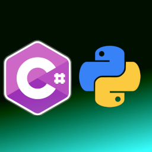

<h1 align="left">PythonNetWrapper </h1> 


<a href="https://github.com/LiorBanai/PythonNetWrapper/issues">
    
</a> 
<a href="https://github.com/LiorBanai/PythonNetWrapper/blob/master/LICENSE">
    
</a>
[](https://www.nuget.org/packages/PythonNetWrapper/)
[](https://www.nuget.org/packages/PythonNetWrapper/) [](https://www.paypal.com/donate/?business=MCP57TBRAAVXA&no_recurring=0&item_name=Support+Open+source+Projects+%28Analogy+Log+Viewer%2C+HDF5-CSHARP%2C+etc%29&currency_code=USD)

# 
a library for executing pythonnet in C# projects

This library  allows you to run python scripts or call python methods inside your C# project.
the basic usage is just to create PythonWrapperController object and use it methods (call Initialize before use):


```cs
public interface IPythonWrapperController
    {
        void Initialize();
        void ShutDown();
        string AddSearchPaths(List<string> paths);
        string PythonPaths();
        /// <summary>
        /// Call Py.Import on the GetFileNameWithoutExtension of the file.
        /// </summary>
        PyObject ImportScript(string fileName, out string log);
        /// <summary>
        /// Executes a Python command text or script 
        /// </summary>
        T ExecuteCommandOrScript<T>(string textCommandOrScript, out string log);
        /// <summary>
        /// Import the file name and call the specific method
        /// </summary>
        T ExecuteMethod<T>(string fileName, string methodName, out string log, params PyObject[] args);
        /// <summary>
        /// Execute a method on an imported script Object
        /// </summary>
        T ExecuteMethodOnScriptObject<T>(PyObject script, string methodName, out string log, params PyObject[] args);
    }
```


```cs  
   public class PythonWrapperController : IPythonWrapperController
    {
        private readonly IPythonWrapperEngine _pythonWrapperEngine;
        private string pathToVirtualEnv;
        private string pythonExecutableFolder;
        private string pythonDll = "python37.dll";
        private IntPtr pythonThreads;
        private bool enableLogging;
        private bool throwOnErrors;
        private bool initialized;
        public PythonWrapperController(IPythonWrapperEngine pythonWrapperEngine, string pathToVirtualEnv, string pythonExecutableFolder,
        string pythonDll = "python37.dll", bool throwOnErrors = true, bool enableLogging = true)
        {
            _pythonWrapperEngine = pythonWrapperEngine;
            this.pathToVirtualEnv = pathToVirtualEnv;
            this.pythonExecutableFolder = pythonExecutableFolder;
            if (!string.IsNullOrEmpty(pythonDll))
            {
                this.pythonDll = pythonDll;
            }
            this.enableLogging = enableLogging;
            this.throwOnErrors = throwOnErrors;
        }

        public PythonWrapperController(string pathToVirtualEnv, string pythonExecutableFolder, string pythonDll = "python37.dll",
        bool throwOnErrors = true, bool enableLogging = true) 
            : this(new PythonWrapperNet(), pathToVirtualEnv, pythonExecutableFolder, pythonDll, throwOnErrors, enableLogging)
        {
        }
        public PythonWrapperController(string pathToVirtualEnv, string pythonExecutableFolder, IPythonLogger logger,
        string pythonDll = "python37.dll", bool throwOnErrors = true, bool enableLogging = true)
            : this(new PythonWrapperNet(logger), pathToVirtualEnv, pythonExecutableFolder, pythonDll, throwOnErrors, enableLogging)
        {
        }
         ..
```


you have the following options:
1. ImportScript: allows you to import a script and call methods on that script.
2. RunScript: content of py file to execute (the text itself , not the file path).
3. ExecuteMethod: execute a method of a file (the file is imported and the method is called.)
